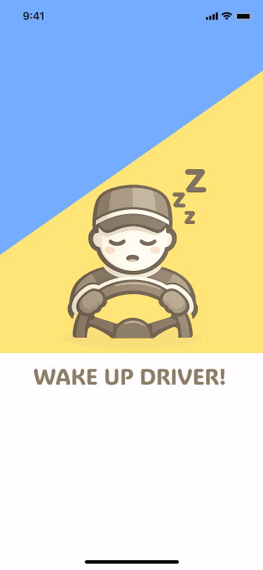
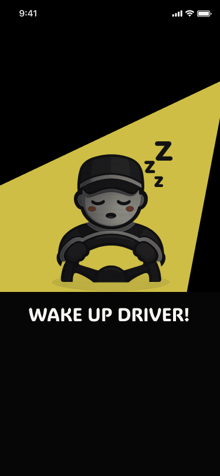
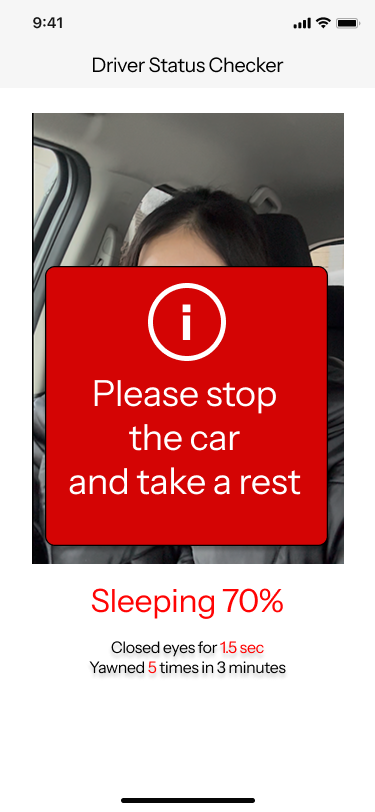

# Wake Up Driver! – Android App

A simple Android prototype for driver drowsiness detection.

#### This app uses:

- CameraX for camera input
- ML Kit Face Mesh for face landmarks
- ROI cropping (eyes and mouth)
- MobileNetV3 classifier exported with ExecuTorch (.pte)

#### The goal is to detect:
Awake / Drowsy / Sleeping 

The app estimates drowsiness using two on-device classifiers (eye open/closed, mouth yawn/no_yawn) and a simple time-based rule to map them into Awake / Drowsy / Sleeping.

## Requirements
- Android Studio (recent version)
- Android 12+ (minSdk 31)
- Front camera (permission required at runtime)

## App Screens
#### Splash Screen

Light Mode

Dark Mode

#### Main Screen

Alert 

## How It Works

1. Camera captures frames using CameraX.
2. ML Kit detects face mesh landmarks.
3. Eye and mouth regions are cropped (ROI).
4. Cropped images are resized and converted to tensor.
5. MobileNetV3 model (.pte) runs inference with ExecuTorch.
6. Drowsiness logic calculates eye closed duration and yawning duration.

#### Decision Logic (draft)
- Awake vs Drowsy is decided by `drowsyScore` (>=50% => Drowsy, otherwise Awake).
- If eyes stay closed for >=0.6s, `drowsyScore` is pushed to at least 51% immediately.
- If eyes stay closed for >=1.5s, `Sleeping` overrides other states and an alert banner is shown.
  While sleeping, repeated/long >=1.5s closures increase `sleepScore` (e.g., +10% per event, or +15%/sec).
- During normal blinking (<0.6s), both drowsy/sleep scores decay by 1% per 10 seconds.

This prototype is intentionally tuned to be conservative (high sensitivity) because even ~2 seconds of sustained eye closure can be dangerous while driving.

## Model
- Architecture: MobileNetV3 (+ MobileNetV4 in Future)
- Export format: ExecuTorch (.pte)
- Inference: On-device only
- No cloud dependency

### Model Input / Output
Both models use ImageNet normalization.

**Eye model**
- Input: 128×128 RGB
- Labels: 0=Open, 1=Closed

**Mouth model**
- Input: 160×160 RGB
- Labels: 0=no_yawn, 1=yawn

**Normalization**
- mean: [0.485, 0.456, 0.406]
- std:  [0.229, 0.224, 0.225]

#### Model Files
- `app/src/main/assets/models/eye_model.pte`
- `app/src/main/assets/models/mouth_model.pte`

## Status
This project is a prototype for research and learning purposes.

## Limitations
- This is a prototype and not tuned for all driving environments.

## Disclaimer
- This app is not a certified safety system and should not be used as a real driving safety device.

## TODO
Planned improvements (not scheduled)
- [ ] ADD NightMode for Main Page
- [ ] ADD Japanese Version
- [ ] Update the model to handle night driving mode